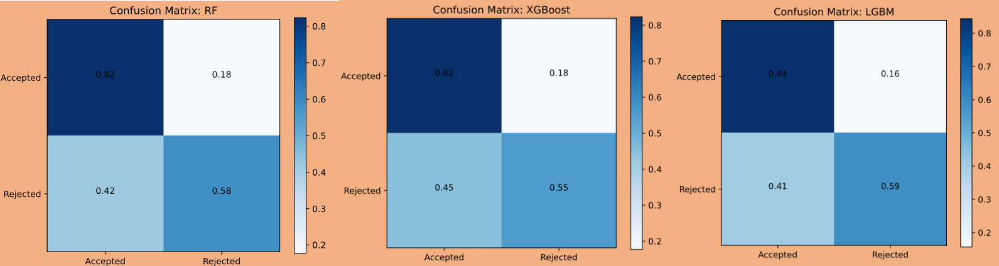
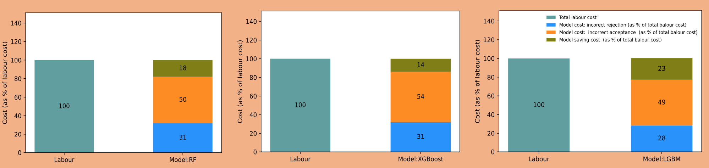
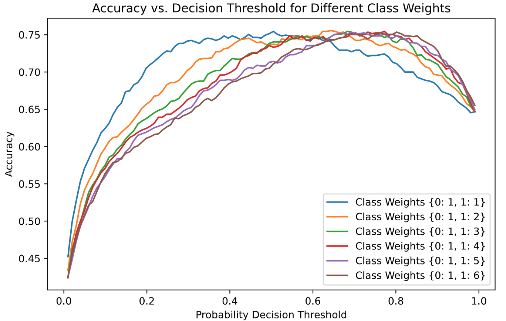
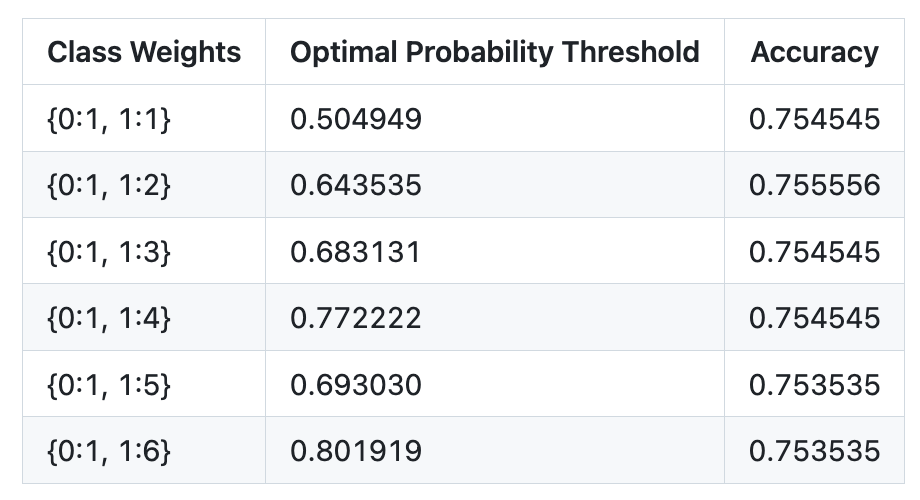

# 💳 Credit Scoring Lending Automation

## 📚 Introduction

The automation of lending decisions through machine learning is transforming the financial landscape by bringing speed, scalability, and data-driven precision to credit risk assessment. Historically, lending decisions were made using time-consuming manual processes that relied heavily on human judgment and rigid rule-based systems. These conventional approaches often suffered from inefficiencies, inconsistencies, and embedded biases, which not only delayed loan processing but also created barriers for underserved populations. The integration of machine learning allows institutions to transcend these limitations, leveraging vast datasets to make faster and more equitable decisions.

Machine learning models have the capability to analyze thousands of borrower attributes in seconds—from demographic and financial history to behavioral and transactional patterns—enabling more accurate predictions of default risk. This automation accelerates the underwriting process, reduces operational costs, and minimizes human error. Moreover, it allows financial institutions to process high volumes of loan applications simultaneously, creating a scalable system that adapts to demand fluctuations without the need to proportionally increase personnel or resources. These efficiencies are particularly valuable for fintech startups and digital lenders striving to offer instant or same-day approvals.

In this project, we assess the impact of three powerful machine learning algorithms—**Random Forest**, **XGBoost**, and **LightGBM**—on the loan decision-making pipeline. Each of these algorithms brings unique strengths: Random Forest excels in stability and interpretability, XGBoost offers high accuracy and fine-tuned control over model behavior, and LightGBM stands out for its training speed and performance with large datasets. By comparing their performance on real-world credit datasets, we explore how predictive accuracy, processing speed, and computational efficiency translate into measurable gains in operational cost reduction and customer experience improvement.

Beyond mere automation, the models developed in this project are designed to support **personalized lending**. By generating individualized risk scores, lenders can tailor interest rates and loan terms to align with each applicant's creditworthiness. This dynamic pricing not only improves profitability but also democratizes access to credit by appropriately managing risk. Overall, this work illustrates how a data-driven approach to lending can deliver strategic advantages across speed, fairness, scale, and profitability—positioning machine learning as a cornerstone in the future of digital financial services.

---

## 📌 Business Problem

Manual processing of loan applications remains a significant bottleneck in many financial institutions. This traditional approach demands extensive human labor to review applicant information, assess creditworthiness, and make lending decisions. The process is not only time-consuming but also costly, as it requires a dedicated team of underwriters and analysts to manage the growing volume of applications. As the demand for loans increases, relying solely on manual review becomes inefficient and unsustainable, limiting the institution’s ability to scale operations and meet customer expectations.

Moreover, manual decision-making is inherently prone to human error and subjective bias. Different reviewers may interpret the same application inconsistently, resulting in unpredictable approval outcomes. This inconsistency can undermine trust in the lending process and lead to unfair denials or approvals, exposing the institution to regulatory scrutiny and reputational risk. In addition, slow loan processing times can frustrate customers, reducing satisfaction and increasing the likelihood of applicants turning to competitors or unregulated lenders.

The business impacts of these challenges are profound:

1. **Increased Operational Costs** — High labor expenses are incurred to maintain large underwriting teams, reducing profit margins and creating inefficiencies in resource allocation.
2. **Longer Turnaround Times** — Delays in loan approval adversely affect customer experience and can lead to lost business opportunities, especially in a competitive lending market.
3. **Inconsistent Decision Quality** — Subjectivity in manual reviews can result in poor credit decisions, either exposing lenders to higher default risk or unnecessarily restricting credit access.
4. **Scalability Constraints** — Without automation, institutions struggle to handle surges in application volume, limiting their market reach and growth potential.
5. **Regulatory and Compliance Risks** — Lack of standardized and transparent decision-making processes can increase vulnerability to compliance violations and penalties.

Addressing these issues through automated, machine learning-based credit scoring can dramatically improve efficiency, consistency, and scalability, ultimately enhancing both business performance and customer satisfaction.

---

## 🎯 Main Task

The primary goal of this project is to develop a machine learning model that automates the assessment and decision-making process for loan applications. This system must minimize incorrect approvals (which can lead to financial losses) and incorrect rejections (which can damage customer relations and reduce revenue), while maximizing decision accuracy. Ultimately, the model should drive operational efficiency, reduce dependence on manual labor, and scale seamlessly to handle increasing loan volumes—all critical to sustaining competitiveness and profitability in the lending market.

To achieve this, the approach involves several business-focused tasks:

1. **Data Collection and Preparation: Building a Reliable Foundation**  
   Collect and cleanse extensive loan application data, including customer demographics, credit history, and repayment records. Proper data preparation ensures the model is trained on accurate, consistent information, directly impacting decision quality and reducing costly errors in lending.

2. **Feature Engineering: Extracting Business-Relevant Insights**  
   Develop predictive features that reflect borrower creditworthiness, such as income stability, debt ratios, and credit utilization. Well-crafted features enable the model to capture subtle risk patterns, enhancing predictive accuracy and supporting smarter lending decisions that lower default rates and protect the institution’s capital.

3. **Model Selection and Training: Maximizing Predictive Performance**  
   Train and compare machine learning algorithms—Random Forest, XGBoost, and LightGBM—that have proven successful in credit scoring. Optimizing these models with cross-validation ensures high accuracy and robustness, which translates into better risk management, fewer losses, and improved customer trust.

4. **Performance Evaluation: Balancing Risk and Opportunity**  
   Use metrics like precision, recall, and AUC to evaluate model performance, with particular focus on reducing false positives and negatives. This careful evaluation minimizes financial risk from bad loans and preserves growth opportunities by approving creditworthy applicants, thereby sustaining business growth.

5. **Cost Reduction Analysis: Driving Operational Efficiency**  
   Quantify the reduction in loan processing time and labor costs achieved through automation. Faster, automated decisions decrease overhead expenses and improve customer satisfaction by delivering prompt loan approvals, giving the lender a competitive edge in the market.

6. **Deployment and Integration: Enabling Scalable and Compliant Operations**  
   Ensure the model can be seamlessly integrated into existing loan processing systems for real-time decision-making. Incorporate monitoring and retraining protocols to maintain performance over time, while meeting regulatory standards and maintaining transparency—critical for sustainable, scalable business operations.

This comprehensive, business-driven approach ensures the project delivers not only a high-performing credit scoring model but also measurable improvements in risk management, cost efficiency, and customer experience.

---

## 🛠️ Tools and Data Management

This project leveraged a combination of powerful tools and platforms to efficiently manage, retrieve, and analyze loan application data, ensuring seamless integration between data storage and machine learning workflows.

- **Data Storage and Retrieval**:  
  The loan application dataset was stored in a **PostgreSQL** relational database, managed through **DBeaver**, a versatile database management tool. Using DBeaver, SQL queries were crafted to extract relevant data subsets directly from the PostgreSQL platform. This approach enabled precise, real-time data retrieval, reducing data preprocessing time and improving the overall efficiency of the modeling pipeline.

- **Data Querying and Processing**:  
  SQL queries were designed to filter, aggregate, and prepare data for machine learning analysis. By querying the database directly, the team ensured the models were trained on the most up-to-date and accurate information, which is critical in dynamic financial environments where timely decisions impact revenue and risk management.

- **Machine Learning Framework**:  
  The core modeling leveraged popular and scalable algorithms such as **LightGBM (LGBM)**, **Random Forest (RF)**, and **XGBoost**, implemented using Python libraries optimized for performance and interpretability. Hyperparameter tuning and model validation were conducted using **Microsoft AutoML (FLAML)**, which automated the search for optimal model settings and facilitated efficient use of computational resources.

- **Business Impact**:  
  The integration of these tools not only streamlined the technical workflow but also aligned with business goals by enabling rapid, data-driven loan decisioning. The end-to-end system—from data extraction in PostgreSQL through model deployment—supports scalable, consistent, and transparent lending processes, ultimately reducing operational costs and improving customer satisfaction.

This robust toolchain ensured that the data pipeline was reliable, the modeling was precise, and the resulting automation solution was well-positioned to drive meaningful business outcomes.

## 🚀 Performance Evaluation of the Models

Model performance is critical in ensuring reliable and profitable lending decisions. To maximize predictive accuracy, hyper-parameter tuning was performed using Microsoft AutoML’s FLAML framework, which leverages automated cross-validation to systematically explore parameter combinations. This optimization process ensures that each model—Random Forest, XGBoost, and LightGBM—operates at peak efficiency, reducing misclassifications that could lead to costly loan defaults or missed revenue opportunities.

By carefully managing the ‘time budget’ during tuning, the approach balances computational expense with model improvement, allowing the institution to deploy effective models faster without incurring excessive resource costs. The resulting models demonstrate high accuracy, precision, and recall, directly impacting the lender’s risk mitigation strategies and enhancing customer satisfaction through quicker, more accurate loan decisions.

Ultimately, this rigorous evaluation and tuning process supports scalable, automated credit scoring systems that minimize human bias and error, reduce operational costs, and improve portfolio quality—key factors that strengthen competitive advantage and drive long-term business growth in the increasingly data-driven financial services sector.

As shown in the evaluation results, the three machine learning models achieved accuracy scores ranging between 72% and 76%, with the Light Gradient Boosting Machine (LGBM) Classifier outperforming the others across all key metrics. This positions LGBM as the leading model in striking a crucial balance between precision and recall, which is essential for correctly approving creditworthy applicants while minimizing risky approvals. For lenders, this balanced performance translates into more reliable decisions that safeguard revenue while maintaining customer satisfaction through fair treatment.

The F1-score, a harmonic mean of precision and recall, is highest for LGBM, indicating its superior ability to balance the trade-offs between false positives (wrongly approving risky applicants) and false negatives (wrongly rejecting good applicants). From a business perspective, this balanced approach reduces costly errors in loan processing: fewer defaults due to risky loans slipping through, and fewer missed revenue opportunities from unjust rejections. The LGBM model thus aligns well with the dual goals of risk mitigation and market competitiveness.

Recall is especially critical in credit scoring, and LGBM demonstrates the highest recall rate, meaning it excels at identifying applications that should be rejected. This reduces the risk of approving potentially harmful loans (false negatives), which directly lowers financial losses and bad debt provisions. For financial institutions, deploying a model with high recall protects capital and reinforces regulatory compliance by minimizing the risk of extending credit to unqualified borrowers.

In contrast, while Random Forest (RF) provides a reasonably reliable alternative, it falls slightly behind LGBM in precision and recall metrics. Nevertheless, RF can still be leveraged in scenarios where interpretability or model stability is prioritized. Offering a dependable fallback, RF supports continuous operations if LGBM requires retraining or adjustment, ensuring the lending platform remains robust.

On the other hand, XGBoost underperforms relative to the other models, with lower precision, recall, and overall accuracy. This means it generates more false positives and false negatives, increasing both financial risk and customer dissatisfaction due to inappropriate approvals or rejections. Although XGBoost is widely popular for classification tasks, its current performance suggests a need for further hyper-parameter tuning, feature engineering, or model ensemble strategies to unlock its potential in this specific credit scoring context.

For evaluation, the dataset consisted of 9,898 loan applications, split into 90% for training and 10% for testing with unseen data. This approach ensures that model performance reflects real-world generalizability rather than overfitting. The use of a large and representative test set provides lenders confidence that these results will translate into improved decision-making and operational efficiency at scale, empowering institutions to process high application volumes swiftly while maintaining sound risk controls.

---

## 📈 Further Evaluation Based on Confusion Matrices

The Light Gradient Boosting Machine (LGBM) classifier excels at correctly approving valid loan applications, achieving a true positive rate of 84%. This strong ability to identify genuine, creditworthy applicants directly translates into increased loan approvals, which can significantly boost lending revenue. By efficiently distinguishing good applicants, LGBM helps financial institutions maximize business growth while maintaining prudent risk management.

Additionally, LGBM demonstrates a relatively low false positive rate of 41%, indicating it effectively minimizes the rejection of valid loan applications. Avoiding false rejections is critical not only for protecting potential revenue but also for preserving customer satisfaction and brand reputation. Customers who are wrongly denied loans may seek alternatives or lose trust in the lender, so reducing this risk helps retain market share and fosters long-term client relationships.

Random Forest (RF) performs robustly, with a true positive rate of 82%, slightly behind LGBM. While RF remains a strong contender for loan approval tasks, its marginally lower ability to approve valid loans means it might miss some genuine applicants. This can lead to a small but notable reduction in revenue opportunities. However, RF still offers a good balance between precision and recall, supporting consistent decision-making in credit approvals and rejections.

Compared to LGBM and RF, XGBoost delivers the weakest performance, with the lowest true positive rate and the highest rate of missed valid loan approvals. This results in a higher number of incorrectly rejected deserving applicants, which can severely limit lending volume and harm customer satisfaction. Such underperformance highlights the need for further tuning or reconsideration before XGBoost is deployed in production credit scoring systems.

Overall, the performance gap suggests that lenders aiming for optimal business outcomes should prioritize deploying or further refining LGBM and RF models. Leveraging these algorithms can improve the accuracy of loan approvals and rejections, reduce operational risks, and enhance customer trust—critical factors for sustaining competitiveness and profitability in the evolving financial services landscape.

---

## 💰 Cost Evaluation

Accurately evaluating the financial impact of machine learning models in lending automation is critical for demonstrating their business value. This analysis quantifies the costs associated with incorrect loan decisions—namely, the costs from incorrect acceptance (false positives) and incorrect rejection (false negatives)—and compares these against the baseline labor costs of manual loan processing. By converting these error costs into percentages of total labor expenditure, the evaluation provides a clear, relatable metric for stakeholders to understand the tangible savings generated by automation.

The model assessments were performed using test data, simulating real-world scenarios where true borrower risk is unknown during application review. This approach validates how each model’s predictive accuracy translates into operational cost implications in practice, rather than relying on training data results that may overestimate performance. Such rigor ensures that the cost savings reported reflect realistic expectations of machine learning deployment in financial institutions.

The breakdown of costs reveals that incorrect loan acceptance accounts for a significantly higher proportion of total labor costs, ranging between 49% to 54%. This aligns with the confusion matrix findings where false positives (incorrect approvals) occur more frequently than false negatives (incorrect rejections). Given the higher financial risk of wrongly approving bad loans, this insight highlights a critical area for further refinement. Focused efforts in improving data quality, feature engineering, and algorithm tuning will be vital to mitigate these costly errors.

Conversely, the cost contribution from incorrect rejections is lower, representing about 28% to 31% of total labor costs. Although these errors reduce potential revenue by denying creditworthy applicants, their financial impact is somewhat less immediate compared to losses from defaults. However, minimizing false rejections remains strategically important for customer satisfaction, brand loyalty, and long-term market competitiveness, emphasizing the need for balanced model optimization.

Overall, the three machine learning models demonstrate notable cost-saving potential compared to traditional manual processing. The estimated labor cost reductions range from 14% to 23%, showcasing the operational efficiency gains that automation can deliver. Notably, the LGBM model achieves the highest savings at 23%, reaffirming its superior balance of predictive accuracy and risk management seen in earlier evaluations.

These cost savings not only reduce operational expenditure but also free up human resources for higher-value tasks, enhance decision-making speed, and support scalable loan processing volumes. Implementing models like LGBM enables financial institutions to streamline their credit risk workflows, reduce financial losses from loan defaults, and improve overall profitability in a competitive lending market.

---

## ⚖️ Class Weights and Optimal Probability Thresholds

Having identified the LGBM model as the best performer among those tested, we further explored how adjusting its probability decision threshold affects classification outcomes under different class weight settings. Class weights in tree-based models like LGBM influence how the model balances the importance of different classes—in this case, approved versus rejected loan applications. By varying these weights from the default balanced setting of {0: 1, 1: 1}, we can fine-tune the model’s sensitivity toward minimizing either false approvals or false rejections based on business priorities.

The analysis reveals that both the optimal probability decision threshold and the resulting accuracy of the LGBM model are highly dependent on the chosen class weights. This implies that lending institutions can strategically adjust these parameters to align the model’s decision boundary with their risk appetite and operational goals. For example, increasing the weight on the rejection class may reduce risky loan approvals but could also increase false rejections, impacting customer experience. Hence, this flexibility enables a tailored approach to risk management and cost optimization in automated lending decisions.

For this specific credit scoring problem, the optimal accuracy was achieved when the class weights were set to `{0: 1, 1: 2}`, meaning the model places twice as much importance on correctly identifying the positive class (loan rejections) relative to the negative class (loan approvals). At this weighting, the probability decision threshold that maximizes model performance is approximately **0.6435**. This adjustment reflects a strategic business choice to prioritize reducing false negatives—i.e., minimizing the risk of incorrectly approving high-risk loan applicants. By doing so, financial institutions can more effectively mitigate potential losses from defaults, strengthening overall risk management while maintaining a balanced level of loan approvals to support business growth.

The accompanying figure illustrates how the probability decision threshold varies as the difference between class weights changes. Notably, when the class weights are more balanced (closer in value), the model requires a lower threshold to reach high accuracy, meaning it is more lenient in approving loans. Conversely, as the disparity between the class weights increases, the threshold rises, reflecting a more conservative approval stance. This relationship highlights the flexibility lenders have to calibrate their risk tolerance and operational priorities through class weighting and threshold selection, tailoring the automated decision-making process to optimize the trade-off between maximizing revenue and minimizing credit risk.

---

## 🏁 Conclusion and Recommendations

### Conclusion

This study demonstrates that integrating machine learning models, particularly the Light Gradient Boosting Machine (LGBM) Classifier, can significantly transform the loan approval process by enhancing both efficiency and predictive accuracy. The LGBM model outperformed Random Forest and XGBoost by delivering the best balance between precision and recall, which is critical for minimizing both false approvals and false rejections. This balance directly translates into improved risk management and better customer experience, as valid applicants are approved more reliably while high-risk applications are effectively filtered out.

Automating lending decisions with machine learning also offers substantial cost benefits. Our analysis shows that using LGBM can reduce labor-related processing costs by up to 23%, providing a scalable solution that can handle increasing application volumes without proportional increases in staffing. This cost saving not only boosts profitability but also accelerates turnaround times, allowing financial institutions to remain competitive in a fast-paced market where customer expectations for swift service are rising.

The study further highlights the importance of tuning model parameters and decision thresholds to align with business priorities. Adjusting class weights in the LGBM model to {0: 1, 1: 2} — effectively weighting loan rejection errors more heavily — resulted in optimal accuracy, reflecting a prudent risk management approach. This ability to calibrate the model provides lenders with the flexibility to tailor their decision systems according to risk appetite and regulatory requirements.

### Recommendations

Based on the findings, it is highly recommended to adopt the LGBM Classifier as the primary engine for automated loan decision-making. Its superior accuracy, efficiency, and cost-saving potential make it the most effective choice among the evaluated models. Implementing LGBM can streamline loan processing workflows, reduce dependency on manual labor, and ultimately enhance the institution’s operational resilience.

To maximize these benefits, continuous efforts should be made to optimize model performance through advanced data engineering practices and regular retraining on fresh data. Reducing incorrect approvals and rejections further mitigates financial risks and protects brand reputation by maintaining customer trust.

Finally, while XGBoost showed comparatively lower performance in this evaluation, it remains a valuable candidate for future exploration. Additional hyperparameter tuning, feature engineering, or even hybrid ensemble approaches could improve its predictive power. Exploring alternative models and incorporating business feedback loops will ensure the automated lending system remains adaptive and robust in evolving market conditions.

## 📬 Contact

For further questions or collaborations, feel free to reach out:

**Vinylango25**  
[GitHub Profile](https://github.com/Vinylango25)

