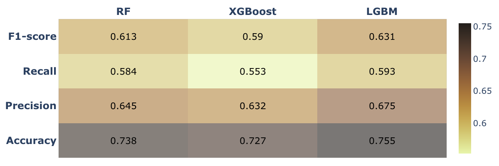

# Credit Scoring and Lending Automation

## Overview
This project automates the loan approval process by using machine learning models to assess borrower risk. Traditional credit scoring is manual, time-consuming, and prone to inconsistencies. Our system accelerates decision-making, reduces operational costs, and minimizes human bias in lending.

Automating lending decision-making using machine learning is revolutionizing the finance and 
lending industry by leveraging advanced algorithms to streamline and enhance the approval process.

 
  Traditionally, loan approvals involved labor-intensive manual reviews and subjective judgments which 
 not only leads to inefficiencies and potential biases but also can be time consuming.

Machine learning lending decision automation hold high promise in speeding up the approval process, 
reducing the time from application to decision, improving operational efficiency and reducing on 
labor-related costs.

Automated systems enables real-time processing of loan applications, can handle large volumes of 
applications simultaneously and hence scaling operations without the need for proportional 
increases in resources.

This work focus on evaluating the extend at which leveraging the three machine learning 
algorithms: Random Forest, XGBoost and LGBM in loan application decision making can reduce 
the cost of loan processing

# Credit Scoring and Lending Automation

## Overview
Automating loan decision-making using machine learning is revolutionizing the finance and lending industry. Traditional manual loan approvals are labor-intensive, prone to inconsistencies, and often introduce biases.  
This project leverages advanced machine learning algorithms to streamline loan approvals, improve operational efficiency, minimize labor costs, and enhance risk management.

---

## Business Problem
Manual processing of loan applications is costly, slow, and requires extensive human resources.  
**Main Objective**: Develop machine learning models that automatically predict whether a loan application should be **approved** or **rejected**, reducing dependency on human review.

---

## Dataset and Preprocessing
- A dataset containing **9,898 loan applications** was used.
- Data was split into **90% training** and **10% testing** to simulate real-world scenarios (evaluating on unseen data).
- Features included income, loan amount, previous delinquencies, credit history, and more.

---

## Approach
1. Data cleaning and preprocessing.
2. Training three machine learning models:
   - **Random Forest Classifier**
   - **XGBoost Classifier**
   - **LightGBM Classifier**
3. Hyperparameter tuning using **Microsoft AutoML (FLAML)** to optimize model performance.
4. Model evaluation through multiple metrics: accuracy, F1-score, recall, ROC-AUC.
5. Cost analysis based on prediction errors.
6. Threshold tuning for optimal decision-making.

---

## Key Visualizations and Insights

### 1. Class Distribution


- The dataset exhibited moderate class imbalance with more approved than rejected loans.
- This imbalance motivated the use of recall, precision, and F1-score alongside accuracy for a fair evaluation.

---

### 2. Feature Importance - Random Forest


**Top Features Identified**:
- **Income**: Higher income correlates with higher loan approval chances.
- **Loan Amount**: Larger amounts influenced risk assessment.
- **Previous Delinquencies**: A strong rejection indicator.
- **Debt-to-Income Ratio**: Crucial for evaluating repayment ability.

**Insight**: Income and previous repayment history are vital determinants for approval decisions.

---

### 3. Feature Importance - XGBoost


XGBoost showed similar feature importance with slight differences:
- **Credit History Length**: Became more significant compared to Random Forest.
- **Employment Status**: Stability of employment affected approval likelihood.

**Insight**: Borrower stability indicators weigh heavily in approval decisions under boosting models.

---

### 4. Model Performance Summary


| Model         | Accuracy (%) | Key Insights |
|---------------|--------------|--------------|
| Random Forest | ~74%          | Good balance; slightly less effective than LGBM |
| XGBoost       | ~72%          | Lower precision and recall; more false positives/negatives |
| LightGBM      | **~76%**      | Best balance of precision and recall; highest accuracy |

---

## In-depth Model Evaluation

### Confusion Matrix Insights:

- **LightGBM**:
  - **True Positive Rate**: 84% — very effective at approving valid applications.
  - **Low False Positive Rate**: 41% — minimizes wrong rejections.
- **Random Forest**:
  - **True Positive Rate**: 82% — slightly lower than LGBM.
  - Good balance but slightly more missed valid approvals.
- **XGBoost**:
  - Lowest true positive rate.
  - Higher rates of incorrectly rejecting or accepting applicants.

**Conclusion**:  
**LightGBM** offers the best precision-recall tradeoff and is the most business-effective model among the three.

---

## Cost Evaluation and Savings

- Incorrect acceptance (approving bad loans) costs were **49%-54%** of the total labor cost.
- Incorrect rejections (rejecting good loans) cost **28%-31%**.
- **LightGBM** achieved the **highest cost savings (~23%)** when compared to manual labor.
- Overall, using machine learning led to labor savings between **14% and 23%**.

**Insight**: Reducing false positives (wrong acceptances) should be a priority for even greater savings.

---

## Probability Threshold Optimization (LightGBM)

Optimal thresholds were determined by adjusting class weights:

| Class Weights | Optimal Threshold | Accuracy |
|---------------|--------------------|----------|
| {0:1, 1:1}    | 0.5049              | 75.45%   |
| {0:1, 1:2}    | **0.6435**           | **75.56%** |
| {0:1, 1:3}    | 0.6831              | 75.45%   |
| {0:1, 1:4}    | 0.7722              | 75.45%   |

**Key Finding**:  
Setting **class weight {0:1, 1:2}** and a **threshold ~0.6435** yielded the highest classification accuracy.

---

## Conclusion

- **LGBM** is the best-performing model, offering high accuracy, strong risk mitigation, and the highest labor cost savings.
- **Machine learning** in lending decision-making can reduce labor-related costs by **up to 23%**.
- **Cost savings** are higher when minimizing incorrect acceptances (false positives).
- **Model threshold tuning** further enhances approval precision.
  
---

## Recommendations
- **Deploy LightGBM** in production to automate loan decisions.
- Focus on **reducing false positives** through further data engineering and advanced modeling.
- **Monitor XGBoost** and explore further tuning or feature engineering to improve its competitiveness.
- Implement **model monitoring** to track drift and retrain periodically.

---

## How to Run

1. **Clone the repository**:
    ```bash
    git clone https://github.com/Vinylango25/Credit-Scoring-Lending-automation.git
    cd Credit-Scoring-Lending-automation
    ```

2. **Install required libraries**:
    ```bash
    pip install scikit-learn xgboost lightgbm matplotlib seaborn pandas numpy
    ```

3. **Run the notebook**:
    Launch Jupyter Notebook and open `Machine Learning Automation of Loans Approval.ipynb`.

---
